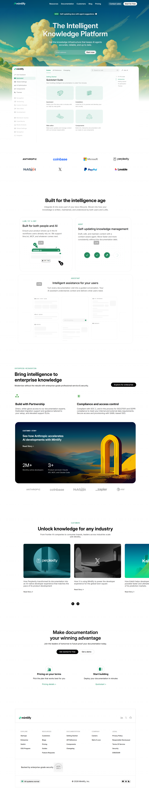

# Mintlify Documentation Website Clone

**Live Demo:**  
https://mintlify-landing-page-chi.vercel.app/

---

## 📌 Project Overview

This project is a **desktop-first clone** of the Mintlify documentation landing page.  
It was built using only **HTML and CSS**, with a focus on **visual fidelity, layout structure, typography, and spacing**.

No JavaScript frameworks, CSS frameworks, or external UI libraries were used — just clean HTML and CSS.

---

## 🧱 Sections Recreated

✅ Navigation Bar with logo and links  
✅ Hero section with badge, main heading, subheading, and email form  
✅ Trusted-by company logos  
✅ Feature section with cards and video previews  
✅ Enterprise features with banners and cards  
✅ Case study / carousel section  
✅ Final call-to-action section  
✅ Footer with multi-column links, social icons, and theme toggles

---

## 🎨 Fonts & Colors Used

### Fonts
- **Inter** – Primary UI and content font  
- **Geist Mono** – Used for small headings and labels

### Color Palette
All colors are defined using CSS variables for consistency:

| Purpose | Color |
|----------|-------|
| Background | `#f4f5f4` |
| Dark Green | `#1d4c56` |
| Light Green | `#45bc97` |
| Badge Accent | `#96b099` |
| Subheading Text | `#08090acc` |
| Text White | `#f4f5f4` |

---

## 🛠 Tech Stack & Constraints

- **HTML5**
- **CSS3**
- ❌ No JavaScript
- ❌ No UI libraries (Tailwind, Bootstrap, etc.)

The clone follows desktop layout principles, closely matching the original Mintlify visuals.

---

## 🖼 Screenshots

